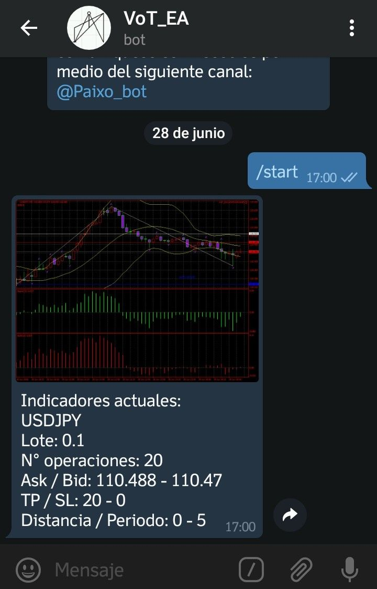
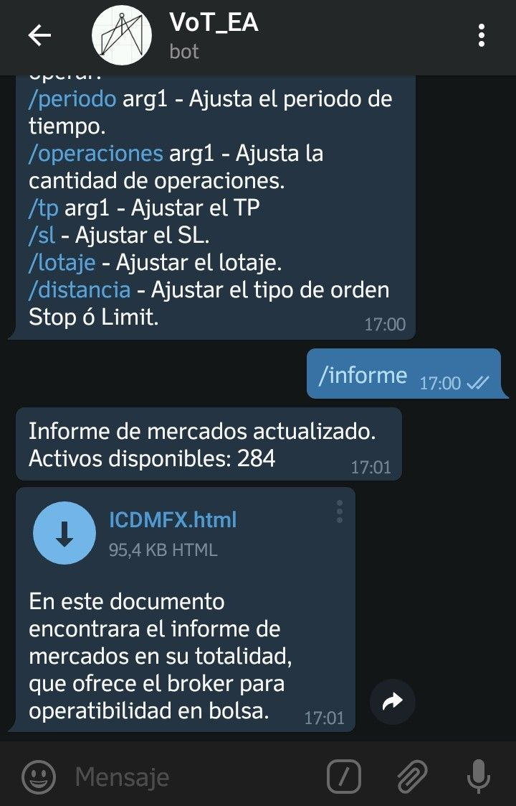
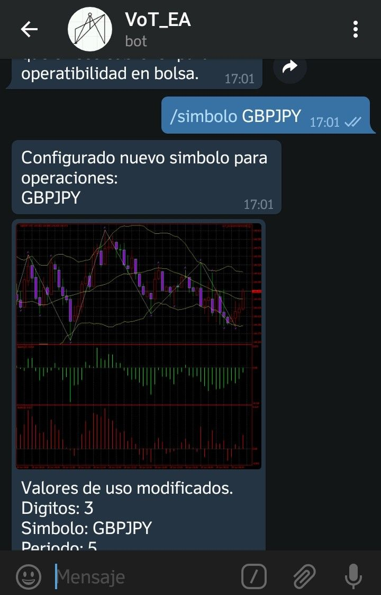
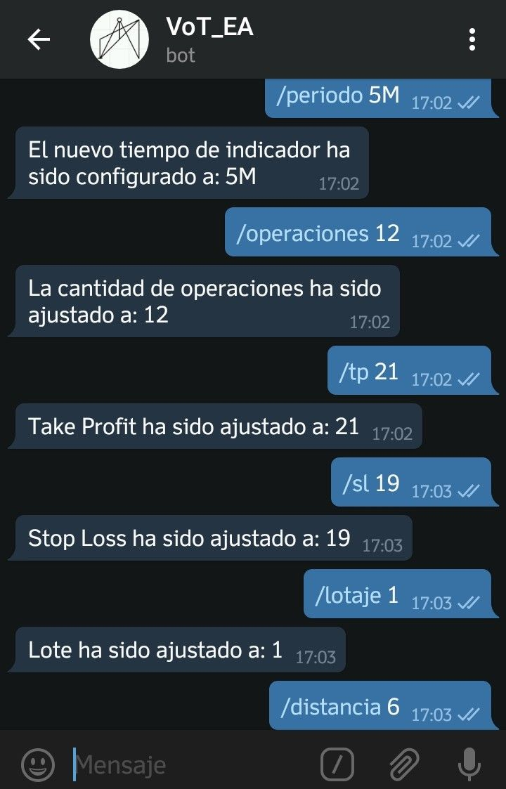

    # W h a l e PP C l u b

    # English
    This tool is for the exclusive use of members of the Whale PP Club, an expert advisor authorized to operate on foreign market, for test purposes, it can be downloaded and used in performance tests, as well as operations in a demo account, if you require it for commercial use, please contact the Paixo Signal team to inform you about the terms of access, affiliations and licenses of use for commercial trading platforms, in MetaTrader4, MetaTrader5, NinjaTrader, ThinksOrSwim.

    For more information, about other projects, ideas and developments related to providing financial solutions, you can contact us.
    DEVOP@PAIXO.INFO  

    # Español
    Esta herramienta es para uso exclusivo de los miembros del Whale PP Club, un asesor experto autorizado para operar en el mercado externo, con fines de prueba, puede descargarse y usarse en pruebas de rendimiento, así como operaciones en una cuenta demo, si es para uso comercial, póngase en contacto con el equipo de Paixo Signal para informarle sobre los términos de acceso, afiliaciones y licencias de uso para plataformas comerciales, en MetaTrader4, MetaTrader5, NinjaTrader, ThinksOrSwim.

    Para obtener más información acerca de otros proyectos, ideas y desarrollos relacionados con la provisión de soluciones financieras, puede contactarnos.
    DEVOP@PAIXO.INFO

    # v 2.0.0
    # -Set_VoT.set    *Configuracion de prueba en cuenta real
    # -SETBCK    *Configuracion de prueba en backtesting
    # -VoT_TPL.tpl    *Plantilla de indicadores

                   ========= VVT_EA ==========
                   ========= ASESOR EXPERTO ==
                   ========= METATRADER ======
    === Configura el tamaño del lote de acuerdo a la información de limite máximo ó minimo segun el broker ===
    === si tienes un broker de 4 ó 2 digitos configura StopLoss y TakeProfit en un rango de 1-100 x punto ===
    === si por el contrario es de 3 ó 5 digitos configura StopLoss y TakeProfit en un rango de 1-10 x punto ===
    === Configura el numero de cada orden (orden_magica) ===
    === la cantidad de operaciones y el espacio entre cada operacion, si vas a usar OPERACION_AL_MERCADO el 
    valor de distancia debe ser 0 ===
    === configura la distancia para operaciones STOP ó LIMIT, y slippage para ajustar el valor maximos (en pips)
    en COMPRA o VENTA)===
    === Activar el trailing-stop y/ó breakeven, agrega el valor de umbral, paso, y marca ===
    === si no quieres utilizar estas caracteristicas, deja los valores en 0 ===
    === Ingresa tu numero de acceso al servicio, si estas en cuenta demo puedes dejarlo en 0 y probarlo ===
    === si lo vas a usar con propositos comerciales para uso en cuenta real, por favor comunicate al 
    siguiente correo ===
    === ------------------------devOp@paixo.info----------------------------------- ===
    === Puedes configurar los tipos de operacion segun la estrategia zigzag combinada con fibonnaci, 
    bear, bull segun la nesecidad del mercado ===
    === FIBONACCI//BEAR_CICLO&&BULL_CICLO(AMBOS SE USAN AL MISMO TIEMPO)//BOLLINGER_BANDAS//
    BOLLINGER_FIBONACCI ===    
    === Selecciona las opciones adicionales de operación ===
    === Cerrar en beneficio de sesión le permite configurar un valor total de beneficio, para 
    cerrar las operaciones
    una vez se logre el limite (beneficio_de_sesion) ===
    === Salir en señal opuesta, permite recibir las señales de salida segun los indicadores, para cerrar 
    las ordenes si cambian de curso al momento de abrirse ===
    === Operación al mercado, habilita las operaciones para que sean comercializadas al valor del mercado ===
    === Configure el StopLossVirtual y el TakeProfitVirtual solo si esta realizando operaciones al mercado. ===
    === si esta realizando operacion con distancia STOP ó LIMIT no utilize estos valores. ===
    === Selecciona un tipo de manejo de dinero para tus recursos, puedes realizar las ordenes segun los 
    parametros de riesgo que definas ===
    === Lote fijo, recoje los valores de StopLoss y TakeProfit para realizar la inversion en una orden 
    no modificable ===
    === Beneficio autonomo, ingresa el valor de umbral de activacion para lotaje variable ===
    === Porcentaje riesgo, ingresa el valor de riesgo (en porcentaje % sobre el valor total de la orden) ===
    === Riesgo fijo, valor de riesgo en porcentual sobre el balance total de la cuenta ===
    === Riesgo fijo por punto, establece un valor de riesgo del set de ordenes en puntos (Point) ===
#ACTUALIZACION / UPDATE VoT (ADMIN_MODE)

Bienvenid@ soy un asesor experto para MT4 y MT5, configurado con indicadores en bandas Bollinger, ZigZag, regresion Fibonacci, Bull, Bear, Fractales para mercados foraneos y divisas, no olvida leer sobre el manual de uso con el comando /ayuda sugerencias y dudas pueden ser resueltas en el siguiente canal @Paixo_bot.

* Si usted es cliente del sistema de señales, solo recibirá notificaciones por este canal, si desea adquirir el bot completo comuníquese con nosotros por medio del siguiente canal: @Paixo_bot

| Comandos de interaccion       | Administrador grupo de señales| Informes de mercado           |
| ----------------------------- | ----------------------------- | ----------------------------- |
|   |   |   |
|   |   |   |

#2018 Paixo Signal.
    
    VoT(ADMIN_MODE)
    
    Comandos de uso:
    inicio - Inicio de operaciones.
    ayuda - Manual de uso.
    informe - Informe actualizado de valores.
    simbolo - Ajusta el simbolo a operar.
    periodo - 1M, 5M, 15M, 30M, 1H, 4H, 1D, 1W, 1MN.
    operaciones - Cantidad de operaciones a ejecutar.
    tp - Tomar beneficio Take Profit.
    sl - Detener perdida Stop Loss.
    lotaje - Ajustar cantidad del lotaje.
    distancia - Ajusta el tipo de orden STOP o LIMIT.
    senales - Activar la señales para un grupo de chat establecido.
    
    
    o::::oooOOOoooO88888888888888888OOOOOOOOOoooooooooo:.                                                 
    .........::::::oOO888888888888OOooooOooooooooooooo::..                                                
    ....       .....oO8888888888OOOoooooo::ooooooo::oo:::..                                               
    ..           ....o888O8888OOOOOOOOo:::::::o::::::::::o:.                    ....   ..                 
    ..           ...::o8888OOOOOOOOOOo::::::::::oo:::::ooo:                    ...... .....               
    ..            ...::O8OOOOOOOOOOoo::::::::::::::::oOooo:                   .... .. .....         ...   
    .              ..:oOOOOOOOOOoooooo:::::::::::::oOOOOOoo.                 ...   ........         ..:.. 
              .:oOOOOOOOOOoooooooo:::::::::::oOOO88OOoo:.                  ............            ...
            .:oOOOOOOOOOooooooooooo:::::::ooOOoOO88OOoooo:                .::::........  .............
       ....ooOOOOOOOOOoooooooooooo:oo:oooOO88O888OOOooooo::..            ..::::::::.............::::::
      ..:oOOOOOOOOOOoooooooooooooooooooOOOO888888Oooooooo:...... .........::::::::::::::::::::::::..:.
    ..:oOOOOOOOOOoooooooooooooooooooOOO8#####8OOOOOOoooo::..:::..               .....................:
    ..ooOOOOOOOoooo:ooooooooooooooooOOO8######8ooOOOO8#8Ooo:::o::.............:::::::::::::::::.......::
    .:oooooooooo::::::::oooooooooooO8888888888#8oooOOOOO8#88OOOoo::::::::::::::.::ooooooooooooo:::::.....:
    oooooo:::::::::::::ooooooOOO8#88Ooo::::::::oooooOOOOOO888888O8O::::::::::::oOO888OOOOOOOOOooo:::::::oo
    o:::..:.::::::oooooooOO8888Ooo:::........::::oooOOOOOo::::ooOOOOoo:::::::::..ooOOO8888888888OOoO88888O
    :::::::::::::ooooooO8888oo:::::::::.......::::ooOOOOOO:.....:::ooOOOoo::::......:oOO88888888888888Oooo
    :::::::::::::::ooOO88O:::::::::::::.......:::::ooOOOOO::::......::oOOOo:oo:.......:oO8888888888888888O
    ::::::::::::::oOO8OOo::::::::::::..:::....:::::ooOOOOO:...::::.....::oOOOo:........:O88888888OO888888O
    ::::::::::::oo88OO8o:::::::::::.....:::...:::::oooOOOO:...:::........::oOOOo:...  .oO8888888OO88888888
    :::::::::::oO88OO8o:::::::::::.:....:::::::::::oooOOOOo::..:::.........::o88OOo:.:oO88888888O888888888
    :::::::::oO88OOOO::::::::::::::.....:::oooo::::oooOOOOOOOOoo::...........:oO88O::O88OOoooooOO888888888
    ::::::::oO88OOOo:::::::::::::......:oooooooooooooOOOOOOOO888OOo:...........:OOOooOOOOOOOOO88OO88888888
    :::::::oO88OOOo::::o::::::::.....:ooooOOOOOOOOOOOOOOOOOOOO88888Oo:::........:oO8OOOOOOOOOoooo:oOO8888o
    ::::::oO88OOOo:::::o::::::::::.:ooooOOOOOOOOOOOOOOOOOOOOOO8888888Oo::........:o88oo:::::::::..::oO888:
    ::::::o88OOO:::::::::::::::::::ooooOOOOOOOOOOOOOOOOOOOOOOO88888888Oo:::.......:O88o::::.:::....:oOO8O:
    :::::oO8OO8o:::::::::::::::::oooooooOOOOOOOOOOOOOOOOOOOOOO888888888OO:::.......:o8O:::::O888o:.:oOOOo:
    :::::o8OOO::::::::::::::::::ooooooooOOOOOOOOOOOOOOOOOOOOO88888888888OO::........:o8O:::::o8#O::oO8O:::
    ::::oO8OOo::::::o:::::::::::oooooooooOOOOOOOOOOOOOOOOOOOO888888888888OO::........:88o::::::ooOO88o::o:
    ::::oO8Oo:...:::o::::::::::ooooooooooooOOOOOOOOOOOOOOOOOO888888888888OOo:........:O8OOoooOO88OOo:::oo:
    ::::oOOO::::.:::::::::::::::::oooooooooooOOOOOOOOOOOOOOOO8888888888OOOOO:.........oO8OOOOOOoo::::::o::
    :::ooOOo:::.:::::::::::::::::::ooooooooooooOOOOOOOOOOOOOOOO88888888OOOOOo:........oO8:::::::::::::oo::
    :::ooOO::::.:::::::::::::::::::::ooooooooooooOOOOOOOOOOOOOOO888888OOOOOOO:........:O8o:::::::::::ooOO8
    :::ooOO::o:::::::::::::::::::::::ooooooooooooooOOOOOOOOOOOOOOOO88OOOOOOOOo........:O#Ooo::oooooOOO8OOo
    :::ooOO::::::::::::::::::::::::::::oooooooooooooooOOOOOOOOOOOOOOOOOOOOOOOOooOOoo:.:8#88OOOOOO8888OOooo
    :::ooOO::::::::::oooooo::::::::::::::ooooooooooooooooOOOOOOOOOOOOOOOOOOOOOOOO888Ooo8#8##OOOOOOOOOOo:::
    :::oooOo:::::::::oooooo::::::::::::::::ooooooooooooooooOOOOOOOOOOOOOOOOOOOOOO8888OO8#8#8OooooOOOo::ooo
All rights reserved PaixoSignal 2018.
