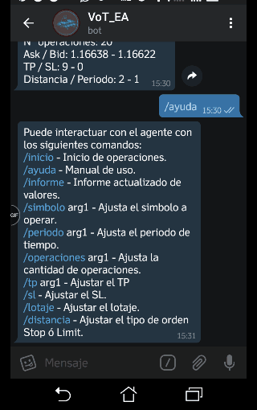
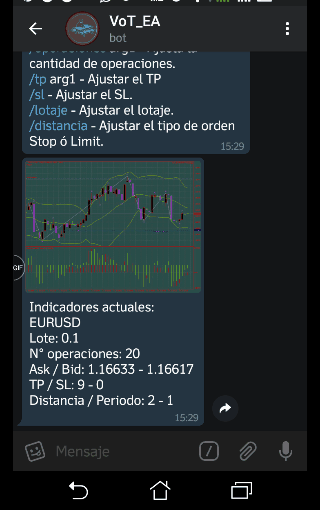
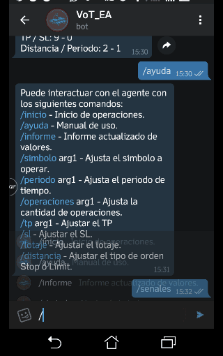

# WhalePP - PaixoSignal :whale2:

### English 🇺🇸

This initiative aims to generate an automated analysis and operation tool in foreign markets, through the use of linear regression, statistics and mathematics applied to a diffuse logic module, using the Telegram platform as a communication module with the user, it can be configured, monitored, together with the market analysis, this report module is part of an initiative previously carried out by a user in MQL5, we only modify slight components to be analyzed with the indicators and strategy as a whole, the pending operations work with the system of distance for orders to the limit or stop, the doubts that may arise and suggestions please share them within the repository to modify according to the needs of the project, if you want to acquire a license of use for real platform please, contact us.

Welcome I am an expert advisor for MT4, configured with indicators in Bollinger, ZigZag, Fibonnacci regression, Bull, Bear, Fractals, Fractals on high frecuency and Bollinger bands with fibonnacci for foreign markets and currencies, do not forget to read about the manual of use with the command /ayuda suggestions and doubts can be resolved in the following channel @Paixo_bot.

### Spanish 🇪🇸

Esta iniciativa tiene como objetivo generar una herramienta de analisis y operacion automatizada en mercados foraneos, por medio del uso de regresion linear, estadistica y matematica aplicada a un modulo de logica difusa, utiliza como modulo de comunicacion con el usuario la plataforma Telegram, puede ser configurado, monitoreado, junto con el analisis de mercado, este modulo de informe es parte de una iniciativa previamente realizada por un usuario en MQL5, solo modificamos ligeros componentes para ser analizados con los indicadores y estrategia en conjunto, las operaciones pendientes funcionan con el sistema de distancia para ordenes al limite o stop, las dudas que puedan surgir y sugerencias por favor compartanlas dentro del repositorio para modificar acorde a las nesecidades del proyecto, si desea adquirir una licencia de uso para plataforma real por favor, contactenos.

Bienvenid@ soy un asesor experto para MT4 y MT5, configurado con indicadores en bandas Bollinger, ZigZag, regresion Fibonacci, Bull, Bear, Fractales, Fractales en alta frecuencia, bandas Bollinger con fibonnacci para mercados foraneos y divisas, no olvida leer sobre el manual de uso con el comando /ayuda sugerencias y dudas pueden ser resueltas en el siguiente canal @Paixo_bot.

## Indicators / Indicadores 📊

   * -Bollinger bands
   * -Zig Zag
   * -MACD
   * -Fractal
   * -Fibonacci

## Commands / Comando de uso 🤖

   * /inicio - Inicio de operaciones.
   * /ayuda - Manual de uso.
   * /informe - Informe actualizado de valores.
   * /simbolo arg- Ajusta el simbolo a operar.
   * /periodo arg- 1M, 5M, 15M, 30M, 1H, 4H, 1D, 1W, 1MN.
   * /operaciones arg- Cantidad de operaciones a ejecutar.
   * /tp arg - Tomar beneficio Take Profit.
   * /sl arg- Detener perdida Stop Loss.
   * /lotaje arg- Ajustar cantidad del lotaje.
   * /distancia - Ajusta el tipo de orden STOP o LIMIT.
   * /senales - Activar el sistema de señales para un grupo determinado. 
   
|           Screenshots            |       Capturas de pantalla       |
| -------------------------------- | -------------------------------- |
|   |   |
|   |   |
   
    * v 2.0.0
                   ========= VoT_EA ==========
                   ========= ASESOR EXPERTO ==
                   ========= METATRADER ======
    === Configura el tamaño del lote de acuerdo a la información de limite máximo ó minimo segun el broker ===
    === si tienes un broker de 4 ó 2 digitos configura StopLoss y TakeProfit en un rango de 1-100 x punto ===
    === si por el contrario es de 3 ó 5 digitos configura StopLoss y TakeProfit en un rango de 1-10 x punto ===
    === Configura el numero de cada orden (orden_magica) ===
    === la cantidad de operaciones y el espacio entre cada operacion, si vas a usar OPERACION_AL_MERCADO el 
    valor de distancia debe ser 0 ===
    === configura la distancia para operaciones STOP ó LIMIT, y slippage para ajustar el valor maximos (en pips)
    en COMPRA o VENTA)===
    === Activar el trailing-stop y/ó breakeven, agrega el valor de umbral, paso, y marca ===
    === si no quieres utilizar estas caracteristicas, deja los valores en 0 ===
    === Ingresa tu numero de acceso al servicio, si estas en cuenta demo puedes dejarlo en 0 y probarlo ===
    === si lo vas a usar con propositos comerciales para uso en cuenta real, por favor comunicate al 
    siguiente correo ===
    === ------------------------devOp@paixo.info----------------------------------- ===
    === Puedes configurar los tipos de operacion segun la estrategia zigzag combinada con fibonnaci, 
    bear, bull segun la nesecidad del mercado ===
    === FIBONACCI//BEAR_CICLO&&BULL_CICLO(AMBOS SE USAN AL MISMO TIEMPO)//BOLLINGER_BANDAS//
    BOLLINGER_FIBONACCI ===    
    === Selecciona las opciones adicionales de operación ===
    === Cerrar en beneficio de sesión le permite configurar un valor total de beneficio, para 
    cerrar las operaciones
    una vez se logre el limite (beneficio_de_sesion) ===
    === Salir en señal opuesta, permite recibir las señales de salida segun los indicadores, para cerrar 
    las ordenes si cambian de curso al momento de abrirse ===
    === Operación al mercado, habilita las operaciones para que sean comercializadas al valor del mercado ===
    === Configure el StopLossVirtual y el TakeProfitVirtual solo si esta realizando operaciones al mercado. ===
    === si esta realizando operacion con distancia STOP ó LIMIT no utilize estos valores. ===
    === Selecciona un tipo de manejo de dinero para tus recursos, puedes realizar las ordenes segun los 
    parametros de riesgo que definas ===
    === Lote fijo, recoje los valores de StopLoss y TakeProfit para realizar la inversion en una orden 
    no modificable ===
    === Beneficio autonomo, ingresa el valor de umbral de activacion para lotaje variable ===
    === Porcentaje riesgo, ingresa el valor de riesgo (en porcentaje % sobre el valor total de la orden) ===
    === Riesgo fijo, valor de riesgo en porcentual sobre el balance total de la cuenta ===
    === Riesgo fijo por punto, establece un valor de riesgo del set de ordenes en puntos (Point) === 
    o::::oooOOOoooO88888888888888888OOOOOOOOOoooooooooo:.                                                 
    .........::::::oOO888888888888OOooooOooooooooooooo::..                                                
    ....       .....oO8888888888OOOoooooo::ooooooo::oo:::..                                               
    ..           ....o888O8888OOOOOOOOo:::::::o::::::::::o:.                    ....   ..                 
    ..           ...::o8888OOOOOOOOOOo::::::::::oo:::::ooo:                    ...... .....               
    ..            ...::O8OOOOOOOOOOoo::::::::::::::::oOooo:                   .... .. .....         ...   
    .              ..:oOOOOOOOOOoooooo:::::::::::::oOOOOOoo.                 ...   ........         ..:.. 
              .:oOOOOOOOOOoooooooo:::::::::::oOOO88OOoo:.                  ............            ...
            .:oOOOOOOOOOooooooooooo:::::::ooOOoOO88OOoooo:                .::::........  .............
       ....ooOOOOOOOOOoooooooooooo:oo:oooOO88O888OOOooooo::..            ..::::::::.............::::::
      ..:oOOOOOOOOOOoooooooooooooooooooOOOO888888Oooooooo:...... .........::::::::::::::::::::::::..:.
    ..:oOOOOOOOOOoooooooooooooooooooOOO8#####8OOOOOOoooo::..:::..               .....................:
    ..ooOOOOOOOoooo:ooooooooooooooooOOO8######8ooOOOO8#8Ooo:::o::.............:::::::::::::::::.......::
    .:oooooooooo::::::::oooooooooooO8888888888#8oooOOOOO8#88OOOoo::::::::::::::.::ooooooooooooo:::::.....:
    oooooo:::::::::::::ooooooOOO8#88Ooo::::::::oooooOOOOOO888888O8O::::::::::::oOO888OOOOOOOOOooo:::::::oo
    o:::..:.::::::oooooooOO8888Ooo:::........::::oooOOOOOo::::ooOOOOoo:::::::::..ooOOO8888888888OOoO88888O
    :::::::::::::ooooooO8888oo:::::::::.......::::ooOOOOOO:.....:::ooOOOoo::::......:oOO88888888888888Oooo
    :::::::::::::::ooOO88O:::::::::::::.......:::::ooOOOOO::::......::oOOOo:oo:.......:oO8888888888888888O
    ::::::::::::::oOO8OOo::::::::::::..:::....:::::ooOOOOO:...::::.....::oOOOo:........:O88888888OO888888O
    ::::::::::::oo88OO8o:::::::::::.....:::...:::::oooOOOO:...:::........::oOOOo:...  .oO8888888OO88888888
    :::::::::::oO88OO8o:::::::::::.:....:::::::::::oooOOOOo::..:::.........::o88OOo:.:oO88888888O888888888
    :::::::::oO88OOOO::::::::::::::.....:::oooo::::oooOOOOOOOOoo::...........:oO88O::O88OOoooooOO888888888
    ::::::::oO88OOOo:::::::::::::......:oooooooooooooOOOOOOOO888OOo:...........:OOOooOOOOOOOOO88OO88888888
    :::::::oO88OOOo::::o::::::::.....:ooooOOOOOOOOOOOOOOOOOOOO88888Oo:::........:oO8OOOOOOOOOoooo:oOO8888o
    ::::::oO88OOOo:::::o::::::::::.:ooooOOOOOOOOOOOOOOOOOOOOOO8888888Oo::........:o88oo:::::::::..::oO888:
    ::::::o88OOO:::::::::::::::::::ooooOOOOOOOOOOOOOOOOOOOOOOO88888888Oo:::.......:O88o::::.:::....:oOO8O:
    :::::oO8OO8o:::::::::::::::::oooooooOOOOOOOOOOOOOOOOOOOOOO888888888OO:::.......:o8O:::::O888o:.:oOOOo:
    :::::o8OOO::::::::::::::::::ooooooooOOOOOOOOOOOOOOOOOOOOO88888888888OO::........:o8O:::::o8#O::oO8O:::
    ::::oO8OOo::::::o:::::::::::oooooooooOOOOOOOOOOOOOOOOOOOO888888888888OO::........:88o::::::ooOO88o::o:
    ::::oO8Oo:...:::o::::::::::ooooooooooooOOOOOOOOOOOOOOOOOO888888888888OOo:........:O8OOoooOO88OOo:::oo:
    ::::oOOO::::.:::::::::::::::::oooooooooooOOOOOOOOOOOOOOOO8888888888OOOOO:.........oO8OOOOOOoo::::::o::
    :::ooOOo:::.:::::::::::::::::::ooooooooooooOOOOOOOOOOOOOOOO88888888OOOOOo:........oO8:::::::::::::oo::
    :::ooOO::::.:::::::::::::::::::::ooooooooooooOOOOOOOOOOOOOOO888888OOOOOOO:........:O8o:::::::::::ooOO8
    :::ooOO::o:::::::::::::::::::::::ooooooooooooooOOOOOOOOOOOOOOOO88OOOOOOOOo........:O#Ooo::oooooOOO8OOo
    :::ooOO::::::::::::::::::::::::::::oooooooooooooooOOOOOOOOOOOOOOOOOOOOOOOOooOOoo:.:8#88OOOOOO8888OOooo
    :::ooOO::::::::::oooooo::::::::::::::ooooooooooooooooOOOOOOOOOOOOOOOOOOOOOOOO888Ooo8#8##OOOOOOOOOOo:::
    :::oooOo:::::::::oooooo::::::::::::::::ooooooooooooooooOOOOOOOOOOOOOOOOOOOOOO8888OO8#8#8OooooOOOo::ooo
    All rights reserved PaixoSignal 2018.
